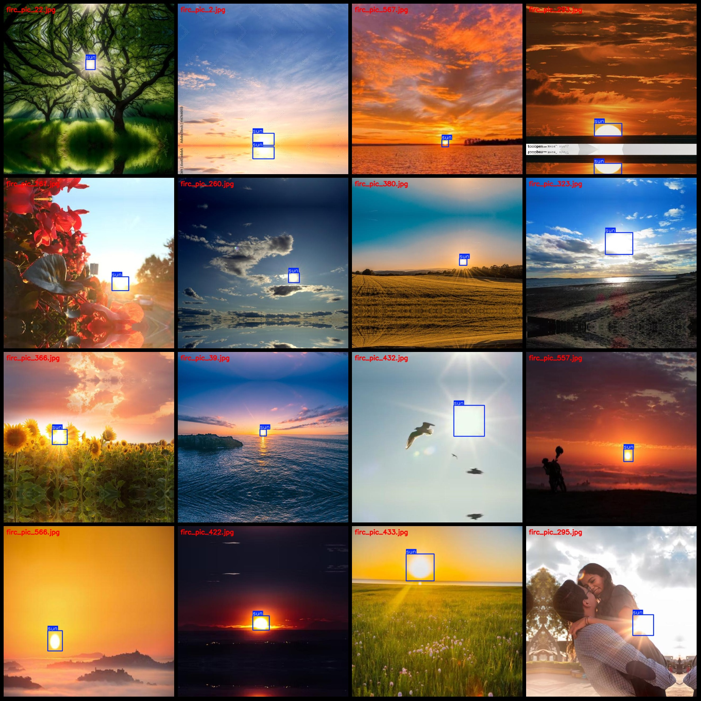
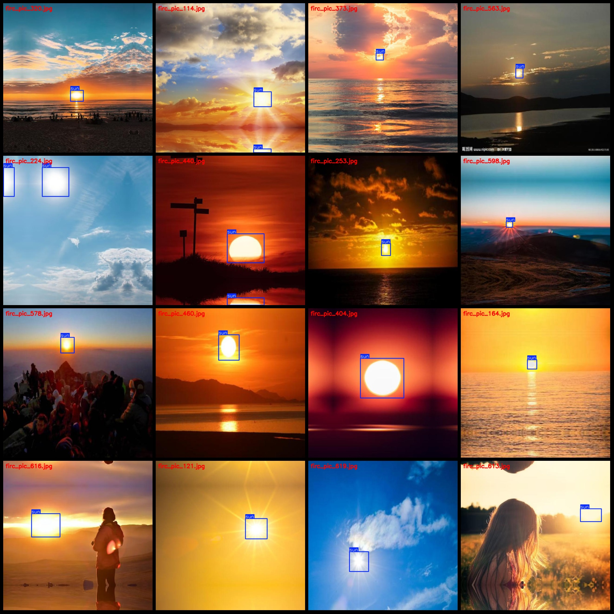

# Sun Detection Dataset: VOC+YOLO Format, 652 Images with One Category

Dataset Format: Pascal VOC format + YOLO format (txt files without split paths, containing only jpg images and corresponding VOC format xml files and yolo format txt files).
Number of Images (jpg file count): 652
Number of Annotations (xml file count): 652
Number of Annotations (txt file count): 652
Number of Categories: 1
Annotation Category Name: ["sun"]
Number of Boxes per Category:
- sun boxes = 808
Total Boxes: 808
Number of Images per Category:
- sun images = 652
Image Resolution: 640x640
Annotation Tool Used: labelImg
Annotation Rules: Drawing bounding box for each category.
Important Notice: The dataset does not include any split between training, validation, or test sets; you need to partition it yourself.
Special Remark: This dataset does not guarantee the accuracy of models trained on it or the weights files.
Preview of Images:
Annotation Example:

## Images

Here is a pay link on Stripe ( https://buy.stripe.com/3cs8yP7sY87d0vu9AB ). Please contact me lonlonago@foxmail.com after funding $89, and I will send you a complete data files , thank you!

